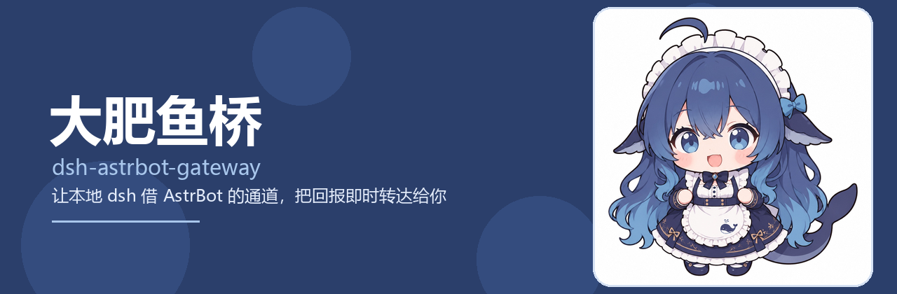

<div align="center">



# dsh-astrbot-gateway

_✨ 大肥鱼桥 · 让本地 AI 智能体借 AstrBot 的通道和用户说话 ✨_

[](https://opensource.org/licenses/MIT)
[](https://github.com/Soulter/AstrBot)
[](https://github.com/qzy033/dsh-astrbot-gateway)
[](https://github.com/qzy033/astrbot_plugin_dsh_gateway)
[](https://www.npmjs.com/package/dsh-astrbot-gateway)

</div>

---

## 版本记录

| 版本 | 时间 | 要点 |
| --- | --- | --- |
| v0.6.0 | 2026-09-13 | 闸门改叫醒机制：消息先落中转箱，三秒内叫醒助手，由助手自己转达；插件本体扶正到独立仓库 astrbot_plugin_dsh_gateway；安装文档重写成完整上手手册 |
| v0.5.0 | 2026-09-12 | 首个公开版本：两侧插件与 npm 包首发，配置项带默认值，可独立安装 |

让本地 AI 智能体（DeepSeek Harness / DSH 等）通过 **AstrBot** 的通道和用户对话。

智能体不再拥有直接给用户发消息的能力：它说的话一律先落进中转箱，AstrBot 侧插件随即在三秒内把那位助手叫醒，由助手自己读中转件、用自己的话讲出来。用户说的话，也先由 AstrBot 侧确认是给它的才放行。

```
┌──────────┐  ① 指令   ┌────────────────┐  ② 拉会话  ┌──────────────┐
│   用户   │ ────────▶ │ AstrBot 侧闸门 │ ────────▶ │  本地智能体  │
│ （聊天） │ ◀──────── │  （唯一出口）  │ ◀──────── │     dsh      │
└──────────┘  ④ 转达   └────────────────┘  ③ 回报   └──────────────┘
                            ▲                            │
                            └──── cache/dsh_relay ◀──────┘
                                 （中转箱，唯一通道）
```

## 三个部分

| 部分 | 位置 | 干什么 |
| --- | --- | --- |
| AstrBot 插件 | 独立仓库 [qzy033/astrbot_plugin_dsh_gateway](https://github.com/qzy033/astrbot_plugin_dsh_gateway) | 提供本地 HTTP 接口，接收智能体的消息，落进中转箱，随即把助手叫醒，由助手自己转达 |
| DSH 侧插件 | `plugin/dsh-astrbot-gateway/`，npm 上是 `dsh-astrbot-gateway` | cordis 插件，负责任务派发、会话拉起、完成后回报 |
| 中转区 | `cache/` | 指令收件箱、结果发件箱、中转箱、访问令牌，运行时自动生成 |

AstrBot 插件本体住在新仓库 <https://github.com/qzy033/astrbot_plugin_dsh_gateway> 里，
**那个仓库的根目录就是插件本身**（`metadata.yaml`、`main.py`、`_conf_schema.json`、`README.md` 直接放根下），
所以插件市场能收录它，装的时候填干净地址即可，不用再带 `/tree/...`。

## 目录

```
dsh-astrbot-gateway/
├── astrbot-plugin/astrbot_plugin_dsh_gateway/   # 搬迁前的历史副本，插件本体已迁到上面那个独立仓库
├── plugin/dsh-astrbot-gateway/                  # DSH 侧（cordis 插件）
├── config/                                      # 提示词模板、插件配置示例，由用户自己填
├── docs/                                        # 设计笔记、消息规则
├── tools/                                       # 台账工具、配置校验脚本
├── cache/                                       # 运行期缓存，勿提交
└── README.md
```

## 安装

两侧可以各装各的，装一侧不会影响另一侧；只是功能上要两边都在才闭环。

总入口在 [docs/install.md](docs/install.md)。最短路径三步走：

1. 先装 AstrBot 侧：面板插件市场搜 `astrbot_plugin_dsh_gateway`，市场里还搜不到就用仓库地址
   `https://github.com/qzy033/astrbot_plugin_dsh_gateway` 一键装，然后填「转达目标账号」。
2. 再装 DSH 侧：把 `plugin/dsh-astrbot-gateway/` 放进 DSH 的 profile，或者从 npm 装
   `pnpm add dsh-astrbot-gateway`，也可以对着 AI 念 `docs/install-dsh.md`。
3. 自检：浏览器打开 `http://127.0.0.1:6185/api/plug/astrbot_plugin_dsh_gateway/ping`，看到 `pong` 就是通了。

只装一侧不会报错，两边都装好才算闭环。插件日志里会打印自检地址，装完顺手看一眼就能确认。

- AstrBot 侧：做成标准 AstrBot 插件，住在独立仓库 [qzy033/astrbot_plugin_dsh_gateway](https://github.com/qzy033/astrbot_plugin_dsh_gateway)，可以像别的插件一样从市场、仓库或压缩包装，见 [docs/install-astrbot.md](docs/install-astrbot.md)。
- DSH 侧：写进 profile 的插件，一步一步的说明见 [docs/install-dsh.md](docs/install-dsh.md)，
  也可以直接对着 AI 念这份文档让它装。

两边都不写死对方的地址：一侧只认目录和文件，另一侧只认本机 HTTP 接口，
所以谁先装、谁后装都不会报错。

详细的用户指南在 [docs/install.md](docs/install.md)，包含装完的验收步骤、回报是怎么讲给你的、
常见问题排查表、数据目录说明与卸载回滚。

## 工作流程

1. 用户在聊天里说要给智能体的话，AstrBot 侧先判断是不是给它的，是就投进收件箱；
2. DSH 侧插件发现新指令，按指令点名的模式拉起会话执行；
3. 执行完写回发件箱，同时把同一份结果推给中转箱；
4. AstrBot 侧三秒内把助手叫醒，由助手自己读中转件、用自己的话讲给用户，讲完归档。

任务完成一定会回报，不需要用户追问。

## 安全说明

- `cache/` 里的 `bridge_access.json` 含自签令牌，**已在 .gitignore 中排除**，切勿提交或外传；
- AstrBot 的接口只绑定回环地址，请勿把端口暴露到公网；
- 本地智能体具备本机文件读写与命令执行能力，等同于授权它操作电脑，请只在可信环境启用。

## 许可

MIT，见 LICENSE。
